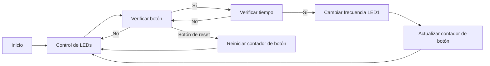

# Practica 2: Interrupciones con leds.
## Objetivos: 
- El objetivo de la practica es comprender el funcionamiento de las interrupciones.
- Para lo cual realizaremos una practica donde controlaremos 2 leds de una forma periódica y una entrada;
de forma que el uso de la entrada provoque un cambio de frecuencia de las oscilaciones pero solo en un
led.
- Añadir un botón de reiniciar. 
## Materiales: 
- ESP32-S3
- 2 botones
- 1 LED rojo
- 1 LED amarillo 
## Procedimiento: 
**Codigo:**
```cpp
    #include <Arduino.h>

    const uint8_t LED1_PIN = 15;
    const uint8_t LED2_PIN = 16;
    const uint8_t BUTTON_PIN = 18;
    const uint8_t RESET_BUTTON_PIN = 19;

    uint32_t led1Interval = 1000; // Frecuencia inicial del LED1 (1 segundo)
    uint32_t led2Interval = 500;  // Frecuencia del LED2 (0.5 segundos)
    uint32_t lastButtonPress = 0; // Variable para almacenar el tiempo del último cambio de frecuencia
    uint32_t buttonPressCount = 0; // Contador de veces que se ha presionado el botón

    void setup() {
    Serial.begin(115200);

    pinMode(LED1_PIN, OUTPUT);
    pinMode(LED2_PIN, OUTPUT);
    pinMode(BUTTON_PIN, INPUT_PULLUP);
    pinMode(RESET_BUTTON_PIN, INPUT_PULLUP);
    }

    void loop() {
    // Control periódico de los LEDs
    static unsigned long previousMillis1 = 0;
    static unsigned long previousMillis2 = 0;
    unsigned long currentMillis = millis();

    if (currentMillis - previousMillis1 >= led1Interval) {
        previousMillis1 = currentMillis;
        digitalWrite(LED1_PIN, !digitalRead(LED1_PIN)); // Cambia el estado del LED1
    }

    if (currentMillis - previousMillis2 >= led2Interval) {
        previousMillis2 = currentMillis;
        digitalWrite(LED2_PIN, !digitalRead(LED2_PIN)); // Cambia el estado del LED2
    }

    // Verificar si se presiona el botón
    if (digitalRead(BUTTON_PIN) == LOW) {
        // Si han pasado al menos 500 milisegundos desde el último cambio de frecuencia
        if (currentMillis - lastButtonPress >= 500) {
        // Cambiar la frecuencia del LED1
        if (led1Interval == 1000) {
            led1Interval = 500; // Cambia a 0.5 segundos
        } else {
            led1Interval = 1000; // Cambia a 1 segundo
        }
        lastButtonPress = currentMillis; // Actualiza el tiempo del último cambio de frecuencia
        buttonPressCount++; // Incrementa el contador de veces que se ha presionado el botón
        Serial.print("Botón presionado ");
        Serial.print(buttonPressCount);
        Serial.println(" veces.");
        }
    }

    // Verificar si se presiona el botón de reset
    if (digitalRead(RESET_BUTTON_PIN) == LOW) {
        // Reiniciar el contador de veces que se ha presionado el botón
        buttonPressCount = 0;
        Serial.println("Contador de botón reiniciado.");
        delay(1000); // Pequeña pausa para evitar rebotes del botón
    }
    }
```
**Descripción:**<br>
Primero definimos los pines para los LED, el botón de los cambios y el botón de reset. Después establecemos una frecuencia inicial para los dos LED, y las variables de cuenteo de los botones. <br>
Una vez en el setup(), configura los pines con el pinMode() como entradas (botones) o salidas (LED). <br>
En el loop(), verifica cada ciclo si hay cambios en los valores leídos por los botones (si se presiona el botón) y actualiza las variables. Si el botón de cambios se presiona, cambia la frecuencia de uno de los LED y registra cuántas veces se ha presionado el botón. Si presionamos el otro botón, (reset), reinicia el contador de botones. 
**Diagrama de flujos:**

**Esquema de montaje:**<br>


**Ejemplo de salida por puerto  serie:**<br>
```
    Botón presionado 1 veces.
    Botón presionado 2 veces.
    Botón presionado 3 veces.
    Botón presionado 4 veces.
    Contador de botón reiniciado.
    Botón presionado 1 veces.
    Botón presionado 2 veces.
```
## Conclusión: 
Controla dos LEDs de forma periódica y monitorea un botón de cambios. Cuando este se presiona, cambia la frecuencia de uno de los LEDs y cuenta cuántas veces se ha presionado el botón. Además, hay un botón de reset que reinicia el contador de veces que se ha presionado.